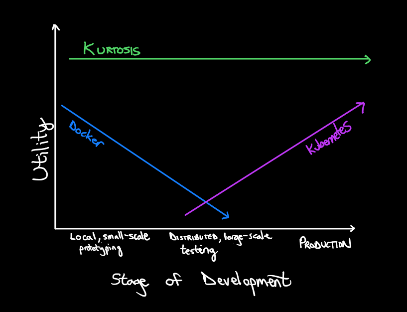

[Kurtosis](https://www.kurtosistech.com) is a platform for orchestrating distributed system environments, allowing easy creation and manipulation of stage-appropriate deployments across in the early stages of the development cycle (prototyping, testing).

Use cases for Kurtosis include:
* Enable individual developers to prototype on personal development environments without messing with environment setup and configuration
* Enable development teams to run automated end-to-end tests for distributed systems, including fault tolerance tests in servers and networks, load testing, performance testing, etc.
* Enable developers to easily debug failing distributed systems during development

Getting Started
---------------
For those who like to jump in and see things running, head over to [the quickstart instructions][quickstart]. For those who prefer to start at a high level, start with [the Kurtosis architecture docs][architecture].

For Q&A, head over to the [Kurtosis Discord](https://discord.gg/6Jjp9c89z9) server.

Getting Started
* [Quickstart][quickstart]
* [Installation][installation-and-upgrading]
* [Adding Tab Completion][adding-tab-completion]
* [Using the CLI][using-the-cli]
* [Our Metrics Philosophy][metrics-philosophy]
* [Debugging common failure scenarios](./debugging-failed-tests.md)
* [Architecture][architecture]

Beyond The Basics
-----------------
* [Kurtosis Modules](./modules.md)

Reference Docs
--------------
* [Glossary](./glossary.md)
* [Running Kurtosis in CI](./running-in-ci.md)
* [kurtosis-engine-api-lib (KurtosisContext) Documentation](./kurtosis-engine-server/lib-documentation)
* [kurtosis-core-api-lib (EnclaveContext) Documentation](./kurtosis-core/lib-documentation)

Upgrading Kurtosis
------------------
* [Upgrading][installation-and-upgrading]
* [Kurtosis CLI Changelog](./kurtosis-cli/changelog)
* [Kurtosis Core Changelog](./kurtosis-core/changelog)
* [Kurtosis Engine Changelog](./kurtosis-engine-server/changelog)

Why Kurtosis?
-------------

Container management and container orchestration systems like Docker and Kubernetes are each great at serving developers in different parts of the development cycle (development for Docker, production for Kubernetes). These, and other distributed system deployment tools, are low-level and stage-specific tools that require teams of DevOps engineers to manage. When applied across the entire development cycle, where many versions of a distributed system environment must be managed, these tools end up incurring a massive amount of maintenance burden and limit capabilties because of their design.

Kurtosis is designed to optimize **environment** management and control across the development cycle - operating at one level of abstraction higher than existing tools, giving developers the environments and the ability to manipulate them as needed at each stage.



With Kurtosis, developers can build with local sandbox environments that really demonstrate how their code will work when integrated with the rest of the system. In addition, advanced end-to-end testing workflows are available to teams using the manipulation tooling in the Kurtosis engine runtime which allow them to do end-to-end testing like fault-tolerance, regression, and performance tests.


Local Development Tips With Docker
----------------------
### Docker Volumes
Kurtosis will create several Docker volumes during the course of normal operation. These are intentionally not deleted after testsuite execution finishes, so that you can explore the volumes for debugging information. This means Docker volumes will slowly accumulate on your system, and you'll want to periodically clear them out. To do so, you can use `docker volume ls` to view existing volumes and identify the ones you'd like to remove, then `docker volume rm THE_VOLUME_ID` to remove them.

### Docker Containers
Much like Docker volumes, Kurtosis will create Docker containers on your system but won't delete them so it doesn't destroy debugging information. This means you'll also need to clear these out periodically. You can use `docker container ls -a` to view all containers (including stopped ones), and `docker container rm THE_CONTAINER_ID` to remove the ones you'd prefer to get rid of.

### Stop all running containers
A handy tip to stop all running containers of a certain image (replace `YOUR-IMAGE-NAME` with the name of the image of the containers you want to remove):

```
docker container ls    # See which Docker containers are left around - these will depend on the containers spun up
docker stop $(docker ps -a --quiet --filter ancestor="YOUR-IMAGE-NAME" --format="{{.ID}}")
```

[quickstart]: https://github.com/kurtosis-tech/kurtosis-onboarding-experience/tree/master#kurtosis-ethereum-quickstart
[adding-tab-completion]: ./adding-tab-completion.md
[metrics-philosophy]: ./metrics-philosophy.md
[architecture]: ./architecture.md
[installation-and-upgrading]: ./installation.md
[using-the-cli]: ./using-the-cli.md
