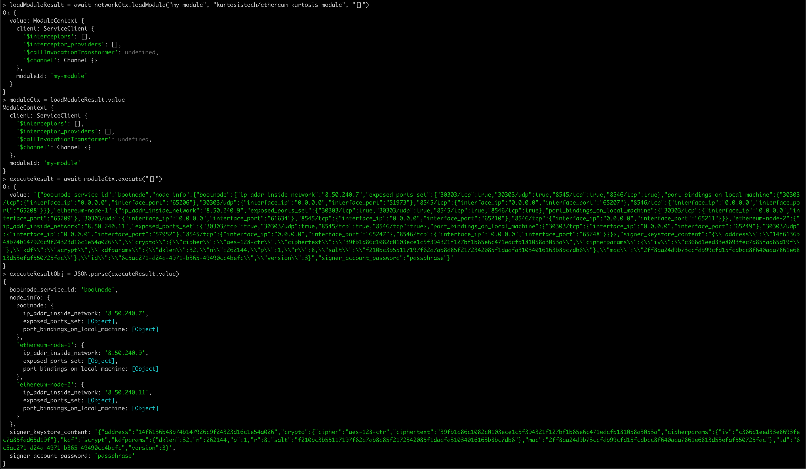

Kurtosis Sandbox
================
Often, Kurtosis is used for its testing ability: run a testsuite, where each test spins up a test network that the test logic runs against. However, it can sometimes be valuable to spin up a test network for freeform manipulation without any test logic. This is the Kurtosis sandbox: a testnet that can be freeform manipulated with a Javascript REPL with [the same tools for interacting with the Kurtosis engine][lib-documentation].

To start a Kurtosis sandbox, first install the Kurtosis CLI:

Homebrew:
```
brew install kurtosis-tech/tap/kurtosis
```

apt:
```
echo "deb [trusted=yes] https://1rRcWo-cTcNiKak7X5tkD7slaIg4GDXrdU@apt.fury.io/kurtosis-tech/ /" | sudo tee /etc/apt/sources.list.d/kurtosis.list
sudo apt update
sudo apt install kurtosis
```

yum:
```
echo '[kurtosis]
name=Kurtosis
baseurl=https://1rRcWo-cTcNiKak7X5tkD7slaIg4GDXrdU@yum.fury.io/kurtosis-tech/
enabled=1
gpgcheck=0' | sudo tee /etc/yum.repos.d/kurtosis.repo
sudo yum install kurtosis
```

Next, run:

```
kurtosis sandbox
```

The Javascript REPL that starts will 1) have `await` available and 2) have a `networkCtx` variable instance of the `NetworkContext` object from [the documentation][lib-documentation].

E.g. starting an Ethereum network using [the Ethereum Lambda](https://github.com/kurtosis-tech/ethereum-kurtosis-lambda):



The commands from above, for copy-pasting:
```
kurtosis sandbox
loadLambdaResult = await networkCtx.loadLambda("eth-lambda", "kurtosistech/ethereum-kurtosis-lambda:0.1.4", "{}")
lambdaCtx = loadLambdaResult.value
executeResult = await lambdaCtx.execute("{}")
executeResultObj = JSON.parse(executeResult.value)
console.log(executeResultObj)
```

---

[Back to index](https://docs.kurtosistech.com)

[lib-documentation]: ./kurtosis-client/lib-documentation
